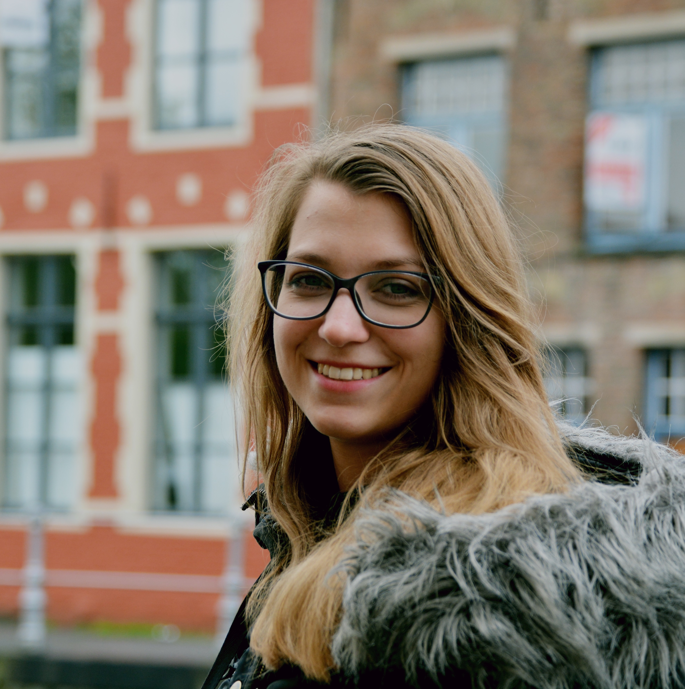
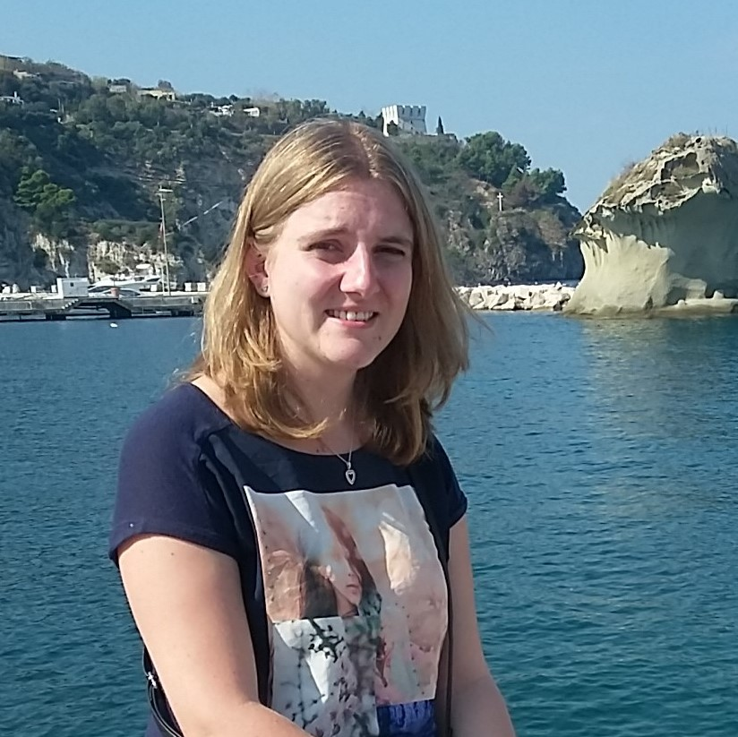
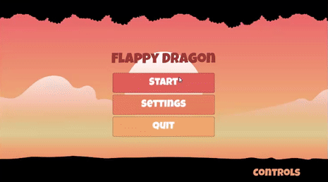
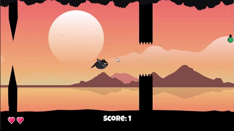
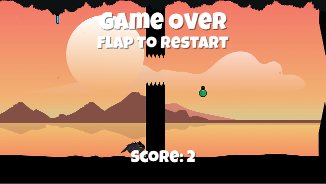
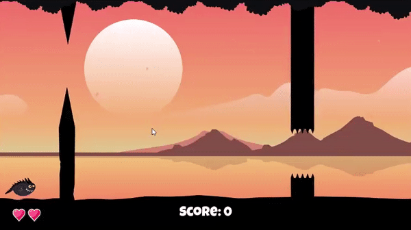
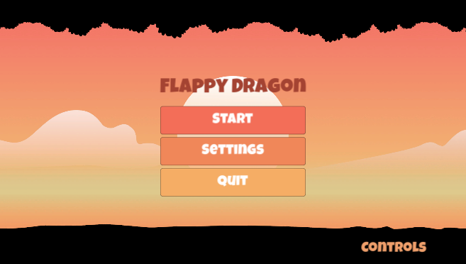
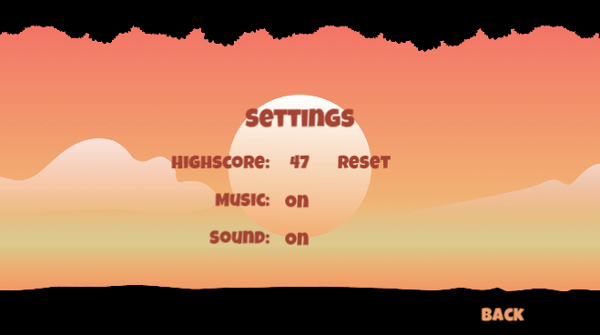
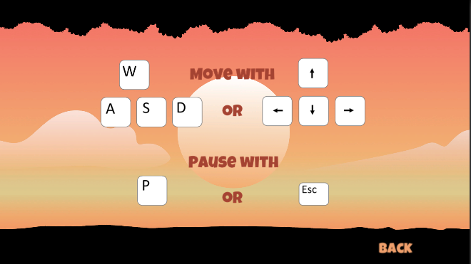
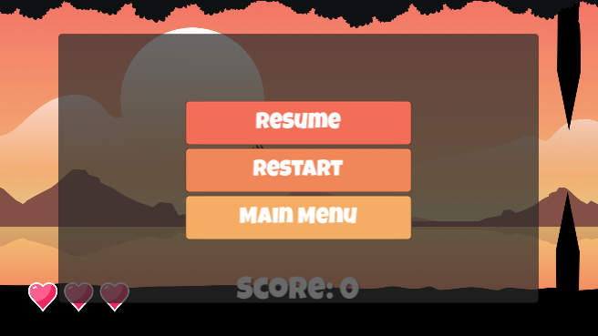

# Flappy Dragon

## Team

|  |  |  |  |  |
|:-----------------:|:-----------------:|:-----------------:|:-----------------:|:-----------------:|
| **Sabrina Hartl**  E-Mail: sabrina1.hartl@stud.uni-regensburg.de  Github-Nutzer: 96Sabiii | **Konstantin Kulik**  E-Mail: konstantin.kulik@stud.uni-regensburg.de  Github-Nutzer: Kotjik | **Melanie Kloss**   E-Mail: melanie.kloss@stud.uni-regensburg.de  Github-Nutzer: AboutWhite | **Burak Sahan**    E-Mail: burak.sahan@stud.uni-regensburg.de  Github-Nutzer: buraks95 || **Vera Wittmann**    E-Mail: vera1.wittmann@stud.uni-regensburg.de  Github-Nutzer: veraarev |

## Beschreibung des Spiels (inhaltlich/Spielziel; Genre und sonstige Eckdaten/Klassifizierungen)

Flappy Dragon ist ein Singleplayer-Spiel, welches in die klassischen Genres Geschicklichkeit und Jump & Run fällt. Es wurde in einem schlichten und ästhetischen 2D Grafikstil gehalten und das Spielgeschehen verläuft von links nach rechts.

Es gibt es keine Sieg-Bedingung - das Ziel des Spiels ist es so viele Punkte wie möglich zu sammeln und somit einen neuen Highscore zu erreichen. Auf dem Weg zum Highscore muss der Spieler in der Luft bleiben und verschiedenen Hindernissen ausweichen, welche ihm entgegen kommen. Durch drücken der entsprechenden Tasten kann der Spieler mit kräftigen Flügelschläge in die Höhe flattert, schneller abstürzen und sich auch nach rechts und links bewegen um möglichst keinen Schaden zu erleiden. Durch das Aufsammeln von verschiedenen Items kann sich der Spieler dabei das Leben erleichtern oder zur Hölle machen.

## Spielmechaniken

Zu Beginn des Spiels hat man 3 Leben.

Durch das Sammeln des "Herz"-Items kann man die Anzahl der Leben erhöhen, jedoch ist die maximale Anzahl an Leben auf 5 begrenzt. Fliegt man gegen ein Hindernis oder erleidet Schaden indem man gegen die Decke oder den Boden fliegt, verliert man ein Leben.

Durch erfolgreiches Durchfliegen eines Hinernisses kann der Spieler Scorepunkte sammeln.

Nach jedem Lebensverlust ist der Spieler für ein paar Sekunden unverwundbar. Hat er keine Leben mehr übrig, heißt es beim nächsten Schaden "Game Over".

Schafft der Spieler es nicht rechtzeitig durch ein Hindernis und droht aus dem Fenster zu steuern, wird er vom linken Rand durch die nächsten Hindernisse geschoben - verliert allerdings dadurch auch immer ein Leben.

Im Verlauf des Spiels kann man verschiedene Items mit unterschiedlichen Funktionen sammeln:

| Bild | Aussehen | Funktion|
| :------: | :------: | ----- |
| | Herz | Spieler erhält ein zusätzliches Leben. |
|  | Feder| Spieler wird für kurze Zeit leichter und kann somit mit einem Flügelschlag höher fliegen und sich schneller nach links oder rechts bewegen. |
|  | Eisenkugel | Spieler wird für kurze Zeit schwerer und muss somit häufiger mit dem Flügel schlagen, um hoch zu kommen. Zudem fällt man schneller auf den Boden und er bewegt sich langsamer nach links und rechts. |
|  | Schild | Spieler wird für kurze Zeit unverwundbar. |
|  | Kleiner Trank | Spieler wird permanent kleiner und passt so leichter durch die Lücken der Hindernisse. |
|  | Mittlerer Trank | Spieler bekommt wieder die ursprüngliche Größe. |
|  | Großer Trank | Spieler wird signifikant größer und es wird schwerer durch die Lücken der Hindernisse zu passen. |

Die Anzeige der aktuellen Leben und der aktueller Score werden unten im Spiel angezeigt. Den Highscore kann man im Hauptmenü unter Optionen einsehen. Das Spiel selbst wird ebenfalls über das Hauptmenü gestartet.

Dort kann man auch Einstellungen zu Highscore, Sound und Musik vornehmen, die Steuerung einsehen oder das Spiel beenden.

Der Dragon kann über WASD oder die Pfeiltasten gesteuert werden . Mit "W" / ↑ macht der Dragon einen Flügelschlag und kann sich somit in der Höhe halten. Die Schwerkraft zieht den Charakter automatisch Richtung Boden, allerdings kann der Spieler auch schneller gen Boden mittels "S" / ↓ steuern. Mit "A" / ← und "D" / → kann sich der Spieler seitlich bewegen.

Während des Spiels kann man dieses über "P" oder "Escape" pausieren. Dabei wird das Pause-Menü aufgerufen. Das laufende Spiel wird zum aktuellen Zeitpunkt eingefroren und kann vom Spieler manuel wieder gestartet werden bzw. gegebenenfalls beendet werden um ins Hauptmenü zurück zu kehren. Außerdem ist es möglich, dass Spiel imm Pause-Menü neu zu starten.

Je mehr Punkte der Spieler erreicht, desto schwieriger wird es den Hindernissen auszuweichen. Die Abstände zwischen zwei Hindernissen verringern sich, die Geschwindigkeit, mit der sie auf den Spieler zukommen, wird erhöht und die Größe der Lücke zum Durchfliegen variiert. Ab einem bestimmten Score fangen die Hindernisse an, sich neben links und rechts auch von oben nach unten (beziehungsweise umgekehrt) zu bewegen.

## Technische Features

Im folgenden werden die technischen Features aufgezählt und beschrieben, welche Person diese implementiert hat. Die Namen der Personen werden abgekürzt: Burak Sahan (B), Konstantin Kulik (K), Melanie Kloss (M), Sabrina Hartl (S) und Vera Wittmann (V).

<li> Bewegung von Boden, Himmel und Obstacles von rechts nach links (B)(K)(M)(S)(V)
<li> Änderung der Größe der Spielfigur bei Aufnehmen von unterschiedlichen Items (K)
<li> Figur kann nicht über die Obstacles hinaus fliegen (K)
<li> Randomisiertes Spawnen von Items (S, B)
<li> Spielfiguranimationen (B)(M)
<li> Lebensanzeige (B)
<li> Lebenszähler bei Verlust oder Erhalt von Leben (B)
<li> Startmenü (V)
<li> Pausemenü inklusive Pausieren des Spiels im Hintergrund (V)(K)
<li> Einfügen aller Items (S)
<li> Spielfigur bleibt innerhalb der Kamera (K)
<li> Hindernisse werden mit der Zeit nach einer bestimmtem Funktion schneller (K)
<li> Abstand zwischen Hindernissen werden mit der Zeit nach einer bestimmtem Funktion kleiner (K)
<li> Hindernisse bewegen sich nach einer bestimmten Zeit zusätzlich von oben nach unten und umgekehrt (M)(K)
<li> Bewegung der Hindernisse von oben nach unten und umgekehrt wird mit der Zeit schneller (K)
<li> Lücke bei Hindernissen variiert (M)
<li> Speichern des Highscores (V)
<li> Resetten des Highscores (V)
<li> Einfügen der Musik und Soundeffekte (V)
<li> Einstellungen zu Musik und Soundeffekten (V)
<li> Steuerungshinweis (V)
<li> Erhöhung des Hindernispools (M)
<li> Steuerung der Spielfigur (K)
<li> Neigung der Spielfigur gen Boden beim Fallen (K)
<li> Spawnalgorithmus der Items (B)(S)
<li> Asseterstellung & Grafikstil (M)
<li> Parallax Effekt (M)
<li> Partikeleffekt: Leichter Ascheregen angelehnt an die Vulkanlandschaft im Hintergrund (M)

## Quellen

Für die Entwicklung des Spiels wurden die folgenden Quellen verwendet:

| Inhalt | Quelle |
| ------ | ------ |
| Font | https://fonts.google.com/ |
| Musik | https://www.bensound.com/ |
| Sounds | https://www.noiseforfun.com/ |
