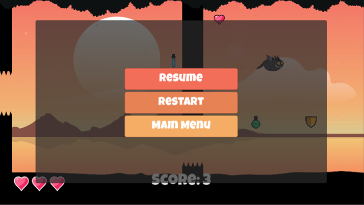

# Flappy Dragon

## Team

| **Sabrina Hartl** | **Melanie Kloss** | **Konstantin Kulik** | **Burak Sahan** | **Vera Wittmann** |
|:-----------------:|:-----------------:|:-----------------:|:-----------------:|:-----------------:|
| E-Mail: sabrina1.hartl@stud.uni-regensburg.de  Github-Nutzer: 96Sabiii |  E-Mail: melanie.kloss@stud.uni-regensburg.de  Github-Nutzer: AboutWhite | E-Mail: konstantin.kulik@stud.uni-regensburg.de  Github-Nutzer: Kotjik | E-Mail: burak.sahan@stud.uni-regensburg.de  Github-Nutzer: buraks95 | E-Mail: vera1.wittmann@stud.uni-regensburg.de  Github-Nutzer: veraarev |

## Beschreibung des Spiels 

Flappy Dragon ist ein Singleplayer-Spiel, welches in die klassischen Genres Geschicklichkeit und Jump & Run fällt. Es wurde in einem schlichten und ästhetischen 2D Grafikstil gehalten und das Spielgeschehen verläuft von links nach rechts.

Es gibt es keine Sieg-Bedingung - das Ziel des Spiels ist es so viele Punkte wie möglich zu sammeln und somit einen neuen Highscore zu erreichen. Auf dem Weg zum Highscore muss der Spieler in der Luft bleiben und verschiedenen Hindernissen ausweichen, welche ihm entgegenkommen. Durch drücken der entsprechenden Tasten kann der Spieler mit kräftigen Flügelschlägen in die Höhe flattert, schneller abstürzen und sich auch nach rechts und links bewegen, um möglichst keinen Schaden zu erleiden. Durch das Aufsammeln von verschiedenen Items kann sich der Spieler dabei das Leben erleichtern oder zur Hölle machen.

Eine im Browser spielbare Version findet man unter: kotjik.github.io/Flappy-Dragon/app/index.html [Link einfügen]

## Spielmechaniken

Zu Beginn des Spiels hat man 3 Leben. Durch das Sammeln des "Herz"-Items kann man die Anzahl der Leben erhöhen, jedoch ist die maximale Anzahl an Leben auf 5 begrenzt. Fliegt man gegen ein Hindernis oder erleidet Schaden indem man gegen die Decke oder den Boden fliegt, verliert man ein Leben. Durch erfolgreiches Durchfliegen eines Hindernisses kann der Spieler Scorepunkte sammeln. Nach jedem Lebensverlust ist der Spieler für ein paar Sekunden unverwundbar. Hat er keine Leben mehr übrig, heißt es beim nächsten Schaden "Game Over". Schafft der Spieler es nicht rechtzeitig durch ein Hindernis und droht aus dem Fenster zu steuern, wird er vom linken Rand durch die nächsten Hindernisse geschoben - verliert allerdings dadurch auch immer ein Leben.

Im Verlauf des Spiels kann man verschiedene Items mit unterschiedlichen Funktionen sammeln:

| Bild | Aussehen | Funktion|
| :------: | :------: | ----- |
| | Herz | Spieler erhält ein zusätzliches Leben. |
|  | Feder| Spieler wird für kurze Zeit leichter und kann somit mit einem Flügelschlag höher fliegen und sich schneller nach links oder rechts bewegen. |
|  | Eisenkugel | Spieler wird für kurze Zeit schwerer und muss somit häufiger mit dem Flügel schlagen, um hoch zu kommen. Zudem fällt man schneller auf den Boden und er bewegt sich langsamer nach links und rechts. |
|  | Schild | Spieler wird für kurze Zeit unverwundbar. |
|  | Kleiner Trank | Spieler wird permanent kleiner und passt so leichter durch die Lücken der Hindernisse. |
|  | Mittlerer Trank | Spieler bekommt wieder die ursprüngliche Größe. |
|  | Großer Trank | Spieler wird signifikant größer und es wird schwerer durch die Lücken der Hindernisse zu passen. |

Die Anzeige der aktuellen Leben und der aktuelle Score werden unten im Spiel angezeigt. Den Highscore kann man im Hauptmenü unter Optionen einsehen. Das Spiel selbst wird ebenfalls über das Hauptmenü gestartet. Dort kann man auch Einstellungen zu Highscore, Sound und Musik vornehmen, die Steuerung sowie Informationen zu den Items einsehen oder das Spiel beenden. Über den Button “Credits” erhält man zudem Informationen zu den Entwicklern und Audioquellen des Spiels. Der Dragon kann über WASD oder die Pfeiltasten gesteuert werden. Mit "W" / ↑ macht der Dragon einen Flügelschlag und kann sich somit in der Höhe halten. Die Schwerkraft zieht den Charakter automatisch Richtung Boden, allerdings kann der Spieler auch schneller gen Boden mittels "S" / ↓ steuern. Mit "A" / ← und "D" / → kann sich der Spieler seitlich bewegen.

Während des Spiels kann man dieses über "P" oder "Escape" pausieren. Dabei wird das Pause-Menü aufgerufen. Das laufende Spiel wird zum aktuellen Zeitpunkt eingefroren und kann vom Spieler manuell wieder gestartet werden bzw. gegebenenfalls beendet werden, um ins Hauptmenü zurück zu kehren. Außerdem ist es möglich, dass Spiel im Pause-Menü neu zu starten. Je mehr Punkte der Spieler erreicht, desto schwieriger wird es den Hindernissen auszuweichen. Die Abstände zwischen zwei Hindernissen verringern sich, die Geschwindigkeit, mit der sie auf den Spieler zukommen, wird erhöht und die Größe der Lücke zum Durchfliegen variiert. Ab einem bestimmten Score fangen die Hindernisse an, sich neben links und rechts auch von oben nach unten (beziehungsweise umgekehrt) zu bewegen.

## Technische Features und Verteilung der Aufgaben

Im Folgenden werden die technischen Features aufgezählt und beschrieben. Daneben wird aufgezählt, welche Person das Feature implementiert hat. Die Namen der Personen werden abgekürzt: Burak Sahan (B), Konstantin Kulik (K), Melanie Kloss (M), Sabrina Hartl (S) und Vera Wittmann (V). Eine genauere Auflistung sämtlicher Features ist in den Issues auf GitHub zu finden. 

- Grundspiel: Erstellen der Hindernisse, sich wiederholender Hintergrund, Grundbewegung des Spielers (B)(K)(M)(S)(V)
- Bewegung von Boden, Himmel und Obstacles von rechts nach links (B)(K)(M)(S)(V)
- Änderung der Größe der Spielfigur bei Aufnehmen von unterschiedlichen Items (K)
  - Stellt eine weitere abwechslungsreiche Spielmechanik dar: der Spieler muss den Items ausweichen oder extra zu ihnen hinfliegen, damit das durchfliegen der Obstacles erleichtert oder nicht erschwert wird.</li>
- Figur kann nicht über die Obstacles hinausfliegen (K)
- Randomisiertes Spawnen von Items (S)(B)
- Spielfiguranimationen (B)(M)
- Lebensanzeige (B)
- Lebenszähler bei Verlust oder Erhalt von Leben (B)
- Startmenü (V)
- Pausemenü inklusive Pausieren des Spiels im Hintergrund (V)(K)
  - Beim Starten des Spiels muss der Spieler vorerst extra einen Flügelschlag ausführen, bevor das Spiel beginnt. Somit wird er nicht ohne Vorwarnung in das Spielgeschehen geworfen.
- Einfügen aller Items und Zerstörung beim Verlassen der Kamera (S)
- Spielfigur bleibt innerhalb der Kamera (K)
- Hindernisse werden mit der Zeit nach einer bestimmten Funktion schneller (K)(M)
  - Trägt der endlosen Spielschwierigkeit bei. Je weiter man kommt, desto schwieriger ist es den Hindernissen auszuweichen. Es besteht aber gleichzeitig keine Endschwierigkeit und das Spiel stellt somit auch für die besten Spieler eine Herausforderung dar. Anfangs erhöht sich die Schwierigkeit etwas schneller, im späteren Spielverlauf wird die Schwierigkeit nur langsam erhöht.
- Abstand zwischen Hindernissen werden mit der Zeit nach einer bestimmten Funktion kleiner (K)(M)
  - Trägt der endlosen Spielschwierigkeit bei (Ausführung siehe oben).
- Hindernisse bewegen sich nach einer bestimmten Zeit zusätzlich von oben nach unten und umgekehrt (M)(K)
  - Trägt der endlosen Spielschwierigkeit bei (Ausführung siehe oben).
- Bewegung der Hindernisse von oben nach unten und umgekehrt wird mit der Zeit schneller (K)
  - Trägt der endlosen Spielschwierigkeit bei (Ausführung siehe oben).
- Lücke bei Hindernissen variiert (M)
- Speichern und Resetten des Highscores (V)
  - Der Spieler sieht seinen individuellen Highscore. Dieser dient als Anreiz - der Spieler kann immer wieder versuchen sich selbst zu übertreffen. Wenn er wieder von “0” Starten möchte, kann der Highscore einfach zurückgesetzt werden.
- Einfügen der Musik und Soundeffekte (V)
- Einstellungen zu Musik und Soundeffekten (V)
  - Musik und Soundeffekte können ein- und ausgeschaltet werden, je nachdem, wo sich der Spieler gerade befindet (z. B. ruhige Umgebung - kein Ton, zu Hause - mit Sound und Musik) bzw. wenn er lieber ohne Musik und Sound spielt, können diese einfach abgestellt werden.
- Steuerungshinweis (V)
  - Um dem Spieler den Einstieg in das Spiel zu erleichtern, hat er die Möglichkeit die Steuerungsmöglichkeiten einzusehen und erhält Informationen zu den unterschiedlichen Items.
- Steuerung der Spielfigur (K)
  - Für mehr Spielerfreiheit und Kontrolle besteht neben der Bewegung nach oben zusätzlich noch die Bewegung nach rechts, links und nach unten. Bei höherer Schwierigkeit kann man somit die Figur gezielter bewegen.
- Neigung der Spielfigur gen Boden beim Fallen (K)
- Asseterstellung & Grafikstil (M)
- Parallax Effekt (M)
- Partikeleffekt: Leichter Ascheregen angelehnt an die Vulkanlandschaft im Hintergrund (M)
- Partikeleffekt: Splittern von Steinen, wenn der Spieler mit einem Hindernis kollidiert (S)
- Partikeleffekt: Vulkanrauch (S)
- Partikeleffekt: Vulkanausbruch bei erstmaligen neuen Highscore (S)(V)
  - Der Spieler erhält dadurch ein visuelles Feedback, wenn er seinen alten Highscore übertroffen hat.

## Feedback von Testspielern
Im Verlauf der Entwicklung gab es zwei große Feedbackschleifen mit jeweils ca. 10 bis 20 Testern. Das erhaltene Feedback wurde dann möglichst umgesetzt. Bei der ersten Feedbackschleife wurde der erste Prototyp (“Alpha-Version”) des Spiels getestet, während bei der zweiten Feedbackschleife eine weiterentwickelte Version des Spiels (“Beta-Version”) getestet wurde. Im Feedback-Dokument konnten die Tester ihre Gedanken unter den Oberbegriffen “Gut”, “Schlecht”, “Könnte besser sein”, “Nützliche Features”, “Weitere Ideen” und “Andere Kommentare” kategorisieren. Das Feedback wurde anonym abgegeben. In der Dokumentation des Projekts wird das Feedback beider Feedbackrunden wortgenau (ggfs. vom Englischen ins Deutsche übersetzt) aufgelistet. Zusätzlich wurden in unterschiedlichen Entwicklungsphasen weitere Tester beim Spielen der Prototypen nach Unregelmäßigkeiten oder Auffälligkeiten während des Spiels befragt, um mögliche Bugs zu beseitigen und ein optimales Spielerlebnis zu liefern.

## Verwendete Quellen

Für die Entwicklung des Spiels wurden die folgenden Quellen verwendet:

verwendete Assets:

| Inhalt | Link |
| ------ | ------ |
| Font | https://fonts.google.com/ |
| Musik | https://www.bensound.com/ |
| Sounds | https://www.noiseforfun.com/ |
| Effects | https://jeanmoreno.com/unity/cartoonfxfree/ |

Tutorials:

| Inhalt | Link |
| ------ | ------ |
| Menü | https://www.youtube.com/watch?v=zIG7ek5KvNg |
| Pause-Menü | https://www.youtube.com/watch?v=q-exLAHGLfk |
| Sound-Handler| https://kurzelinks.de/lg3e |
| Basics | https://kurzelinks.de/o9tk |

